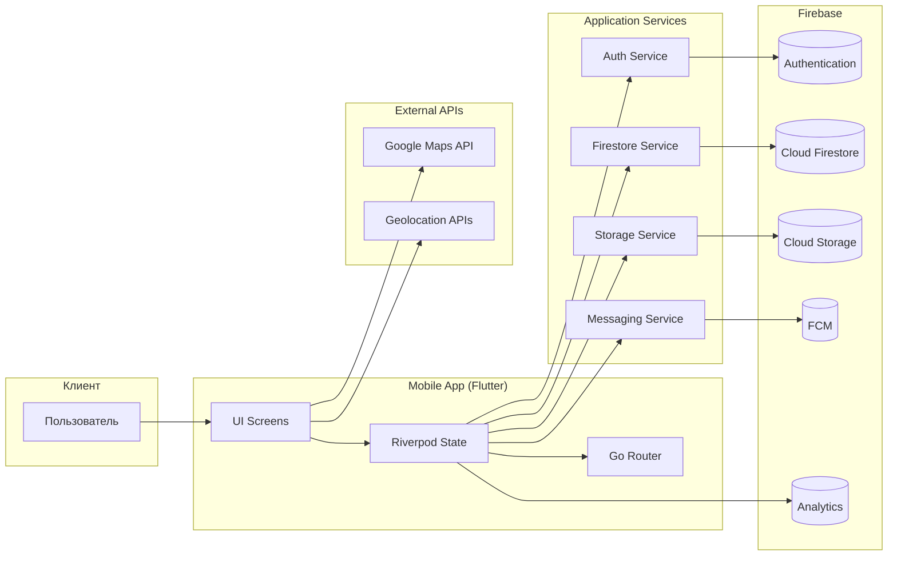

<div align="center">

# HobbyHub

**Мобильная социальная платформа для поиска людей, сообществ и событий по интересам**

[](https://flutter.dev/)
[](https://dart.dev/)
[](https://firebase.google.com/)

</div>

---

## Содержание

- [О проекте](#о-проекте)
- [Технологический стек](#технологический-стек)
- [Архитектура](#архитектура)
- [Быстрый старт](#быстрый-старт)
- [Команды](#команды)

---

## О проекте

### Проблема: Социальная изоляция и разрозненность локальных сообществ

Людям сложно находить единомышленников рядом, организовывать совместные активности и поддерживать живое комьюнити по интересам в одном удобном пространстве.

### Решение: HobbyHub

**HobbyHub** — мобильное Flutter-приложение, объединяющее профиль пользователя, поиск по геолокации, сообщества, события и коммуникацию. Проект использует Firebase как backend-платформу (Auth, Firestore, Storage, Messaging, Analytics) и реализует пользовательские сценарии от онбординга до участия в мероприятиях.

---

## Технологический стек

<div align="center">

| **Категория** | **Технологии** | **Версия / Детали** |
|:---:|:---:|:---:|
| Mobile App | Flutter, Dart, Material 3 | Flutter 3.x, Dart 3.10 |
| State & Navigation | Riverpod, Go Router, GetIt | flutter_riverpod 2.6, go_router 14.6 |
| Backend Platform | Firebase Auth, Firestore, Storage, Messaging, Analytics | Firebase SDK для Flutter |
| Geo & Maps | Google Maps Flutter, Geolocator, Geocoding | Поиск и отображение активностей на карте |
| Data & Utils | Freezed, JSON Serializable, Hive, Dio | Модели, сериализация, локальный кэш, сеть |

</div>

---

## Архитектура



---

## Быстрый старт

### Требования

<div align="center">

| Компонент | Минимум | Рекомендуется |
|:---:|:---:|:---:|
| Flutter SDK | 3.0+ | Latest stable |
| Dart SDK | 3.0+ | 3.10+ |
| Xcode (iOS) | 15+ | Latest |
| Android Studio / SDK | API 24+ | Latest |
| Firebase CLI | 13+ | Latest |
</div>

### Клонирование репозитория

```bash
git clone https://github.com/your-org/hobby_hub.git

cd hobby_hub
```

### Настройки по умолчанию

- Flutter-приложение находится в директории `apps/`
- Firebase-конфиги и правила находятся в `infrastructure/firebase/`
- Конфигурация платформы для приложения: `apps/lib/firebase_options.dart`
- Android Firebase config: `apps/android/app/google-services.json`

### 3. Запуск приложения

```bash
# перейти в приложение
cd apps

# установить зависимости
flutter pub get

# запустить на выбранном устройстве/эмуляторе
flutter run
```

---

## Команды

### App (Flutter)

```bash
# Перейти в директорию приложения
cd apps

# Установка зависимостей
flutter pub get

# Запуск приложения
flutter run

# Статический анализ
flutter analyze

# Тесты
flutter test

# Codegen для моделей (Freezed / JSON)
flutter pub run build_runner build --delete-conflicting-outputs

# Сборка Android APK
flutter build apk --release

# Сборка iOS
flutter build ios --release

# Очистка артефактов
flutter clean
```

### Infrastructure (Firebase)

```bash
# Перейти в инфраструктурную директорию
cd infrastructure/firebase

# Проверка Firestore правил локально (через эмулятор)
firebase emulators:start --only firestore

# Деплой Firestore правил
firebase deploy --only firestore:rules

# Деплой Firestore индексов
firebase deploy --only firestore:indexes

# Деплой Storage правил
firebase deploy --only storage
```
