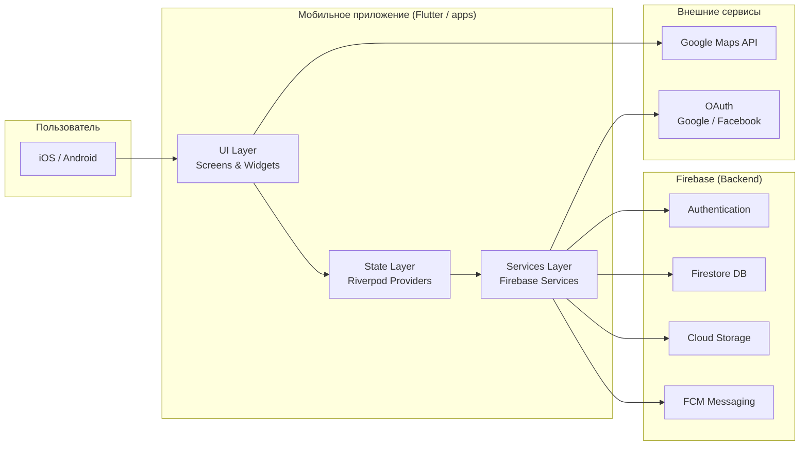

<div align="center">

# HobbyHub

**Мобильная платформа для поиска единомышленников по увлечениям**

[](https://flutter.dev/)
[](https://firebase.google.com/)
[](https://dart.dev/)

</div>

---

## Содержание

- [О проекте](#о-проекте)
- [Технологический стек](#технологический-стек)
- [Архитектура](#архитектура)
- [Быстрый старт](#быстрый-старт)
- [Команды](#команды)

---

## О проекте

**HobbyHub** — мобильное приложение на Flutter для объединения людей по общим увлечениям. Платформа позволяет создавать сообщества, организовывать мероприятия и находить единомышленников через поиск по интересам и геолокации.

---

## Технологический стек

<div align="center">

| **Категория** | **Технологии** | **Версия / Детали** |
|:---:|:---:|:---:|
| Мобильное приложение | Flutter, Dart | Flutter 3.x, Dart 3.x |
| Backend | Firebase: Auth, Firestore, Storage, Messaging, Analytics | Firebase SDK 3.x |
| Управление состоянием | Riverpod | 2.x |
| Навигация | Go Router | 14.x |
| Карты и геолокация | Google Maps Flutter, Geolocator, Geocoding | — |
| Авторизация | Google Sign In, Facebook Auth | — |
| Локальное хранение | Hive, Shared Preferences | — |
| Инфраструктура | Firebase CLI, Firestore Rules & Indexes | — |

</div>

---

## Архитектура



---

## Быстрый старт

### Требования

<div align="center">

| Компонент | Минимум | Рекомендуется |
|:---:|:---:|:---:|
| Flutter | 3.x | Latest stable |
| Dart | 3.x | Latest stable |
| Android SDK | API 24+ | Latest |
| Xcode | 15+ | Latest |
| Firebase CLI | Latest | Latest |

</div>

### Клонирование репозитория

```bash
git clone https://github.com/Zero-Logic-Education/HobbyHub.git
cd HobbyHub
```

### Запуск приложения

```bash
# Установка зависимостей
cd apps && flutter pub get

# Запуск на подключённом устройстве
cd apps && flutter run
```

---

## Команды

### Приложение (apps/)

```bash
# Установка зависимостей
cd apps && flutter pub get

# Запуск на устройстве / эмуляторе
cd apps && flutter run

# Сборка debug APK (Android)
cd apps && flutter build apk --debug

# Сборка release APK (Android)
cd apps && flutter build apk --release

# Сборка iOS
cd apps && flutter build ios --release

# Кодогенерация (Freezed / JSON Serializable)
cd apps && flutter pub run build_runner build --delete-conflicting-outputs

# Статический анализ
cd apps && flutter analyze

# Тесты
cd apps && flutter test

# Очистка артефактов сборки
cd apps && flutter clean
```

### Firebase (infrastructure/firebase/)

```bash
# Деплой правил Firestore
firebase deploy --only firestore:rules

# Деплой индексов Firestore
firebase deploy --only firestore:indexes

# Деплой правил Storage
firebase deploy --only storage

# Полный деплой
firebase deploy
```

### Твое хобби — твои правила. Находи единомышленников и создавай встречи.

**Интуитивный интерфейс · Flutter & Firebase · Простота общения**

</div>

---

## Содержание

- [Быстрый запуск для новых разработчиков](#быстрый-запуск-для-новых-разработчиков)
- [Как запустить проект](#как-запустить-проект)
- [Системные требования](#системные-требования)
- [Технологический стек](#технологический-стек)
- [Основные возможности](#основные-возможности)
- [Структура проекта](#структура-проекта)
- [Команды разработки](#команды-разработки)
- [ROADMAP: План разработки](#roadmap-план-разработки-hobbyhub)

---

## Быстрый запуск для новых разработчиков

> **Работаешь над проектом впервые? Начни здесь!**

### 1. Клонируйте репозиторий

```bash
git clone <repository-url> hobby_hub
cd hobby_hub
```

### 2. Проверьте установку Flutter

```bash
flutter doctor
```

**Если Flutter не установлен:**
- **macOS/Linux:** Следуйте [официальной документации](https://docs.flutter.dev/get-started/install)
- **Windows:** Загрузите с [flutter.dev](https://flutter.dev)

### 3. Установите зависимости

```bash
flutter pub get
```

### 4. Запуск проекта

**Для iOS (macOS):**
```bash
cd ios
pod install
cd ..
flutter run
```

**Для Android:**
```bash
flutter run
```

**Для Web:**
```bash
flutter run -d chrome
```

**Для macOS:**
```bash
flutter run -d macos
```

### 5. Выберите устройство

Flutter автоматически обнаружит доступные устройства. Выберите нужное из списка.

**Готово!** Приложение запущено и готово к работе.

---

## Быстрый запуск (обычный)

> **Стандартный процесс запуска приложения**

### Способ 1: Режим разработки (Рекомендуется)

```bash
flutter run
```

Hot Reload: нажмите `r` в терминале для быстрой перезагрузки.  
Hot Restart: нажмите `R` для полного перезапуска.

### Способ 2: Режим отладки с конкретным устройством

```bash
# Просмотр доступных устройств
flutter devices

# Запуск на конкретном устройстве
flutter run -d <device_id>
```

### Способ 3: Release режим

```bash
# Android
flutter build apk --release

# iOS
flutter build ipa --release

# Web
flutter build web --release

# macOS
flutter build macos --release
```

---

## Системные требования

<div align="center">

| Компонент | Минимум | Рекомендуется | Проверка |
|:---------:|:-------:|:-------------:|:--------:|
| **Flutter SDK** | 3.10+ | 3.24+ | `flutter --version` |
| **Dart SDK** | 3.10+ | 3.5+ | `dart --version` |
| **Xcode** (macOS/iOS) | 14.0+ | 15.0+ | `xcodebuild -version` |
| **Android Studio** | 2022.3+ | 2023.1+ | В настройках IDE |
| **CocoaPods** (iOS) | 1.11+ | 1.15+ | `pod --version` |
| **Git** | 2.0+ | 2.40+ | `git --version` |
| **RAM** | 4 GB | 8 GB+ | — |
| **Диск** | 5 GB | 10 GB+ | Включая SDK и эмуляторы |

</div>

---

## Технологический стек

<table>
<tr>
<td width="50%">

### Frontend

- **Flutter** — UI фреймворк от Google
- **Dart** — язык программирования
- **Material Design** — дизайн-система Google
- **Cupertino** — iOS-стиль виджеты
- **Provider/Riverpod** — управление состоянием
- **Go Router** — навигация
- **Animations** — плавные переходы

</td>
<td width="50%">

### Backend & Tools

- **Firebase** — backend-as-a-service (опционально)
- **Dio/HTTP** — работа с API
- **Shared Preferences** — локальное хранилище
- **Hive/SQLite** — локальная база данных
- **GetIt** — dependency injection
- **Flutter Lints** — линтер для кода
- **Build Runner** — генерация кода

</td>
</tr>
</table>

---

## Основные возможности

<table>
<tr>
<td width="50%">

### Главный экран (Home)

- **Интуитивная навигация**  
  Bottom Navigation Bar с основными разделами
  
- **Адаптивный дизайн**  
  Работает на всех платформах и экранах
  
- **Быстрый доступ**  
  К основным функциям приложения
  
- **Плавные анимации**  
  Встроенные Flutter анимации
  
- **Темная/светлая тема**  
  Автоматическое переключение тем
  
- **Высокая производительность**  
  60 FPS на всех устройствах

</td>
<td width="50%">

### Аутентификация (Auth)

- **Вход и регистрация**  
  Удобные формы с валидацией
  
- **Безопасность**  
  Шифрование данных пользователя
  
- **Social Login**  
  Вход через Google, Apple ID
  
- **Восстановление пароля**  
  Email-подтверждение
  
- **Сохранение сессии**  
  Автоматический вход
  
- **Биометрия**  
  Face ID / Touch ID поддержка

</td>
</tr>
<tr>
<td width="50%">

### Карта (Map)

- **Интерактивная карта**  
  Отображение локаций хобби
  
- **Геолокация**  
  Определение текущего местоположения
  
- **Маркеры и кластеризация**  
  Удобная визуализация точек
  
- **Поиск по карте**  
  Фильтрация по категориям
  
- **Построение маршрутов**  
  Навигация до места события
  
- **Офлайн режим**  
  Кеширование карт

</td>
<td width="50%">

### Профиль (Profile)

- **Персональные данные**  
  Управление профилем пользователя
  
- **Избранное**  
  Сохраненные хобби и события
  
- **История активности**  
  Посещенные мероприятия
  
- **Настройки приложения**  
  Кастомизация под себя
  
- **Уведомления**  
  Управление push-уведомлениями
  
- **Поддержка**  
  Связь с технической поддержкой

</td>
</tr>
</table>

### Архитектурные особенности

<div align="center">

| Функция | Описание |
|:--------|:---------|
| **Clean Architecture** | Разделение на слои: UI, Domain, Data |
| **State Management** | Provider/Riverpod для управления состоянием |
| **Dependency Injection** | GetIt для инверсии зависимостей |
| **Responsive Design** | Адаптация под любые размеры экрана |
| **Локализация** | Поддержка множественных языков |
| **Тестирование** | Unit, Widget и Integration тесты |
| **CI/CD** | Автоматизация сборки и деплоя |

</div>

---

## Структура проекта

```
hobby_hub/
├── lib/
│   ├── core/              # Общие штуки: цвета, шрифты, константы API
│   ├── models/            # Все модели данных (Hobby, User, Meeting)
│   ├── services/          # Работа с внешним миром (Firebase, работа с картой)
│   ├── ui/                # Всё, что касается внешнего вида
│   │   ├── auth/          # Экран входа/регистрации
│   │   ├── home/          # Главный экран (лента хобби)
│   │   ├── map/           # Экран с местами встреч
│   │   ├── profile/       # Профиль пользователя
│   │   └── shared/        # Общие виджеты (кнопки, текстовые поля)
│   └── providers/         # Логика управления состоянием (твои ViewModel)
├── test/                         # Тесты
│   └── widget_test/
├── android/                      # Android конфигурация
├── ios/                          # iOS конфигурация
├── macos/                        # macOS конфигурация
├── web/                          # Web конфигурация
├── windows/                      # Windows конфигурация
├── linux/                        # Linux конфигурация
├── pubspec.yaml                  # Зависимости проекта
└── README.md                     # Этот файл
```

## Firebase конфигурация

### Статус подключения ✓

**Проект:** `hobbyhub-dev` (Production-ready)

### Компоненты Firebase

| Компонент | Статус | Файлы конфигурации |
|:----------|:------:|:------------------|
| **Firestore Database** | ✓ Инициализирована | firestore.rules, firestore.indexes.json |
| **Firestore Rules** | ✓ Развёрнуты | firestore.rules (155 строк) |
| **Authentication** | ✓ Готова | lib/firebase_options.dart |
| **Storage** | ⚠ Требует инициализации* | storage.rules |
| **Cloud Messaging** | ✓ Готова | firebase_messaging пакет |
| **Analytics** | ✓ Готова | firebase_analytics пакет |
| **Android** | ✓ Настроен | android/app/google-services.json |
| **iOS** | ✓ Настроен | ios/Runner/GoogleService-Info.plist |
| **Web** | ✓ Готов | lib/firebase_options.dart |
| **macOS** | ✓ Готов | lib/firebase_options.dart |

*Storage требует инициализации в Firebase Console → Storage → Get Started

### Безопасность

- **Age Verification:** 12+, 18+, 25+ тиры с проверкой на уровне Rules
- **Privacy Levels:** Public (0), Friends (1), Private (2), Hidden (3)
- **Role-based Access:** User, Organizer, Moderator, Admin roles
- **Data Encryption:** Все данные зашифрованы в transit и at rest

### Firestore Collections (9 total)

```
firestore/
├── users/                  # Профили пользователей с возрастом
│   ├── /friends/{friendId}
│   ├── /followers/{followerId}
│   ├── /following/{followingId}
│   ├── /interests/{interestId}
│   ├── /sentRequests/{recipientId}
│   └── /receivedRequests/{senderId}
├── events/                 # События с проверкой minAge
│   ├── /participants/{userId}
│   └── /reviews/{reviewId}
├── communities/            # Сообщества (25+ only для создания)
│   ├── /members/{userId}
│   └── /events/{eventId}
├── interests/             # Справочник интересов
├── messages/              # Личные сообщения
├── notifications/         # Push-уведомления
├── reports/              # Жалобы и модерация
├── activityHistory/      # История активности пользователя
└── userSettings/         # Персональные настройки
```

### Развёртывание на Production

```bash
# Развернуть Firestore Security Rules
firebase deploy --only firestore:rules --project=hobbyhub-dev

# Развернуть Storage Rules (после инициализации хранилища)
firebase deploy --only storage --project=hobbyhub-dev

# Развернуть всё сразу
firebase deploy --project=hobbyhub-dev
```

### Локальная разработка

Flutter автоматически использует Firebase при запуске:

```bash
flutter run  # Использует конфигурацию из lib/firebase_options.dart
```

Все данные записываются в проект `hobbyhub-dev` в real-time.

---

## Команды разработки

<div align="center">

| Задача | Команда |
|:-------|:--------|
| **Запустить dev сервер** | `flutter run` |
| **Hot Reload** | Нажмите `r` в терминале |
| **Hot Restart** | Нажмите `R` в терминале |
| **Установить зависимости** | `flutter pub get` |
| **Обновить зависимости** | `flutter pub upgrade` |
| **Проверить линтером** | `flutter analyze` |
| **Форматировать код** | `flutter format .` |
| **Запустить тесты** | `flutter test` |
| **Собрать APK (Android)** | `flutter build apk` |
| **Собрать IPA (iOS)** | `flutter build ipa` |
| **Собрать Web** | `flutter build web` |
| **Собрать macOS** | `flutter build macos` |
| **Очистить проект** | `flutter clean` |
| **Проверка системы** | `flutter doctor -v` |
| **Список устройств** | `flutter devices` |
| **Генерация кода** | `flutter pub run build_runner build` |
| **Создать иконку** | `flutter pub run flutter_launcher_icons` |

</div>